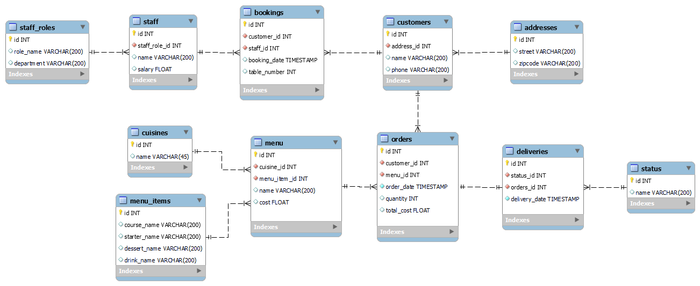
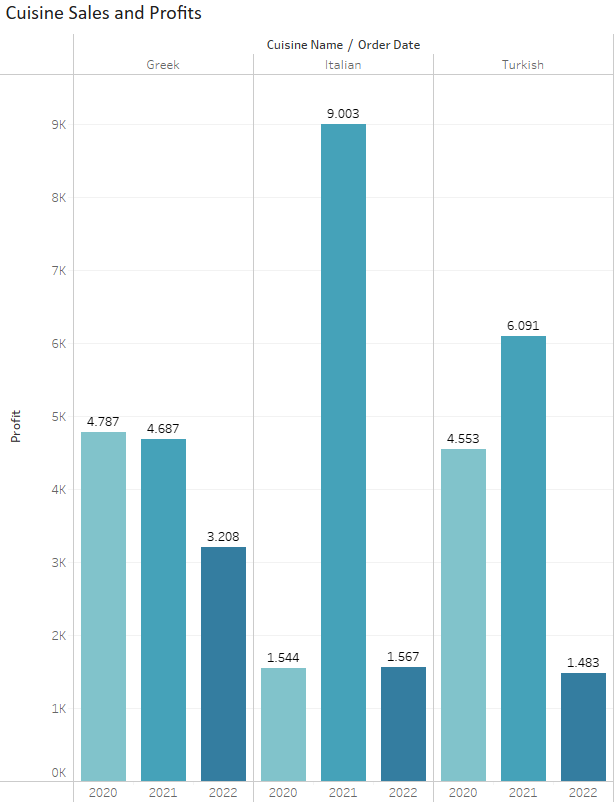
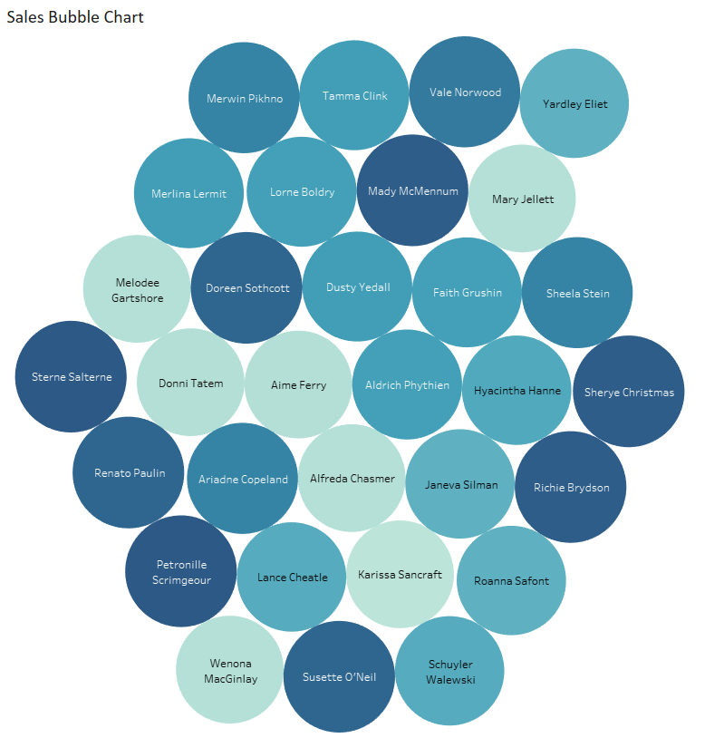
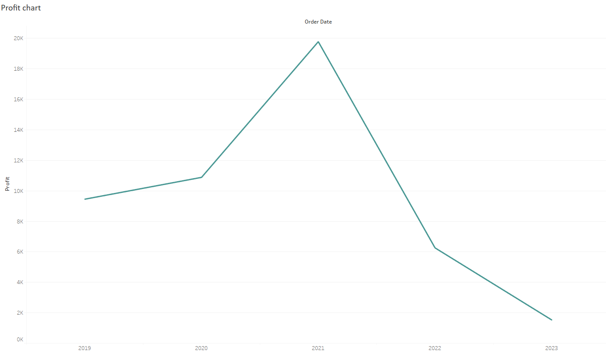
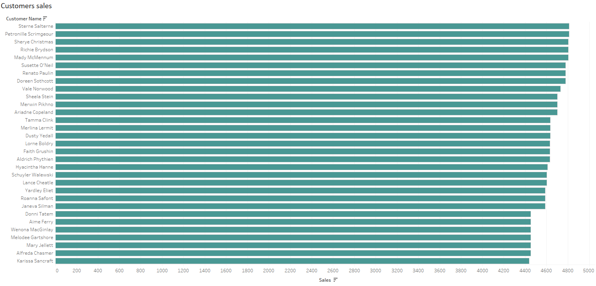

# Meta Database Engineer Capstone Project

A database management project aimed at setting up and optimizing the database environment for Little Lemon, a fast-food restaurant. The project is a part of the [Meta Database Engineer Certificate](https://www.coursera.org/professional-certificates/meta-database-engineer) course on Coursera and it spans from database setup to data visualization using MySQL and Tableau, along with creating a database client in Python

## Project Overview

Key components and steps involved in this project include:

1. MySQL instance configuration and ER diagram design
2. SQL query development
3. Data visualization with tableau and python-based database client

## Project Modules

<h3> 1. MySQL instance configuration and ER diagram design </h3>

- Set up a MySQL instance server using MySQL Workbench.
- Create and implement an ER diagram data model, conforming to the three fundamental forms.
	
<p align="center">
 

- [Foward engineering SQL script](https://github.com/marianamannes/db-capstone-project/blob/master/foward_engineering/script_FowardEngineering.sql)
- [Mock data insert script](https://github.com/marianamannes/db-capstone-project/blob/master/insert/insert_MockData.sql)

<h3> 2. SQL query development </h3>

- Create queries to sales report and booking system.

  <details>
  <summary> Queries to sales report </summary>
  
    <details>
    <summary>Create a view with all orders with a quantity greater than 2</summary>

    ```sql
    CREATE VIEW OrdersView AS
      (SELECT id AS order_id,
                    quantity,
                    total_cost
      FROM orders
      WHERE quantity > 2);
    ```
      
    </details>

    <details>
    <summary>Create a query to return all customers with orders that cost more than $150</summary>

    ```sql
    SELECT c.id AS customer_id,
          c.name as customer_name,
          o.id AS order_id,
          o.total_cost,
          m.name AS menu_name,
          mi.course_name,
          mi.starter_name
    FROM orders o 
    LEFT JOIN customers c ON o.customer_id = c.id
    LEFT JOIN menu m ON o.menu_id = m.id
    LEFT JOIN menu_items mi ON m.menu_item_id = mi.id
    WHERE total_cost > 150
    ORDER BY total_cost;
    ```
      
    </details>
    
    <details>
    <summary>Find all menu items for which more than 2 orders have been placed</summary>

    ```sql
    SELECT m.id AS menu_id,
          c.name AS cuisine_name,
          m.name AS menu_name
    FROM menu m 
    LEFT JOIN cuisines c ON m.cuisine_id = c.id
    WHERE m.id = ANY (SELECT menu_id FROM orders GROUP BY menu_id HAVING COUNT(*) > 2);
      ```

    </details>
    
    <details>
    <summary>Create a procedure that displays the maximum ordered quantity in the Orders table</summary>

    ```sql
    DELIMITER //
    
    CREATE PROCEDURE GetMaxQuantity()
    BEGIN
      SELECT MAX(quantity)
      FROM orders;
    END //
    
    DELIMITER ;
    ```

    </details>
    
    <details>
    <summary>Create a prepared statement to return the order id, the quantity and the order cost to some customer from the Orders table</summary>

    ```sql
    PREPARE GetOrderDetail FROM 'SELECT id, 
                                        quantity, 
                                        total_cost
                                        FROM orders
                                        WHERE customer_id = ?';
    
    SET @id = 1;
    EXECUTE GetOrderDetail USING @id;
    ```

    </details>

    <details>
    <summary>Create a stored procedure to delete an order record based on the user input of the order id</summary>

    ```sql
    DELIMITER //
    
    CREATE PROCEDURE CancelOrder(IN order_id INT)
    BEGIN
      DELETE 
      FROM orders
      WHERE id = order_id;
      SELECT CONCAT("Order ",order_id, " is cancelled.") AS Confirmation;
    END //
    
    DELIMITER ;
    ```

    </details>

  </details>

  <details>
  <summary> Booking System </summary>
    <details>
      <summary>Create a stored procedure to check whether a table in the restaurant is already booked</summary>

      ```sql
      DELIMITER //
      
      CREATE PROCEDURE CheckBooking(IN booking_date_check DATE, IN table_number_check INT)
      BEGIN
        DECLARE table_count INT;
      
        SELECT COUNT(*) INTO @table_count
        FROM bookings
        WHERE CAST(booking_date AS date) = booking_date_check AND
              table_number = table_number_check;
            
        IF (@table_count > 0)
          THEN 
            SELECT CONCAT('Table ', table_number_check, ' is already booked') AS "Booking status";
        ELSE
          SELECT CONCAT('Table ', table_number_check, ' is not booked') AS "Booking status";
        END IF;
      
      END // 

      DELIMITER ;
      ```

    </details>

    <details>
      <summary>Create a stored procedure with a transaction statement to perform a rollback if a customer reserves a table that’s already booked under another name</summary>

      ```sql
      DELIMITER // 
      
      CREATE PROCEDURE AddValidBooking(IN booking_date_insert TIMESTAMP,
                                      IN table_number_insert INT,
                                      IN customer_id_insert INT,
                                      IN staff_id_insert INT)
      BEGIN
          DECLARE table_count INT;
          
          SELECT COUNT(*) INTO @table_count
          FROM bookings
          WHERE CAST(booking_date AS date) = CAST(booking_date_insert AS date) AND
                table_number = table_number_insert;

          START TRANSACTION;
          IF (@table_count > 0)
            THEN ROLLBACK;
            SELECT CONCAT('Table ', table_number_insert, ' is already booked - booking cancelled') AS "Booking status";
          ELSE
            INSERT INTO bookings(customer_id, staff_id, booking_date, table_number) VALUES
                        (customer_id_insert, staff_id_insert, booking_date_insert, table_number_insert);
            COMMIT;
            SELECT CONCAT('Booking completed successfully - table ', table_number_insert, ' is now booked') AS "Booking status";
          END IF;
          
      END // 
      
      DELIMITER ;
      ```

    </details>

    <details>
      <summary>Create a procedure to add a new table booking record</summary>

      ```sql
      DELIMITER //
      
      CREATE PROCEDURE AddBooking(IN booking_id_insert INT, 
                                  IN customer_id_insert INT,  
                                  IN table_number_insert INT, 
                                  IN booking_date_insert TIMESTAMP,  
                                  IN staff_id_insert INT)
        BEGIN
                                  
          INSERT INTO bookings(id, 
                              customer_id, 
                              table_number, 
                              booking_date,  
                              staff_id) 
          VALUES (booking_id_insert, 
                customer_id_insert, 
                table_number_insert, 
                booking_date_insert, 
                staff_id_insert);
      
          SELECT CONCAT('Booking completed successfully - table ', table_number_insert, ' is now booked') AS "Booking status";
      END // 
    
      DELIMITER ;
      ```

    </details>

    <details>
      <summary>Create a new procedure called UpdateBooking that they can use to update existing bookings in the booking table</summary>

      ```sql
      DELIMITER //
      
        CREATE PROCEDURE UpdateBooking (IN booking_id_update INT, 
                                        IN booking_date_update TIMESTAMP)
        BEGIN                           
      
        UPDATE bookings
        SET booking_date = booking_date_update
        WHERE id = booking_id_update;
        
        SELECT CONCAT('Booking ', booking_id_update, ' updated successfully') AS "Confirmation";
        
        END // 
        
      DELIMITER ;
      ```
        
    </details>
  </details>
  
<h3> 3. Data Visualization and Database Client </h3>

- Set up a Tableau Workspace and create an interactive dashboard for sales and profit data.

  <details>
    <summary>Cuisine sales and profits</summary>
     
  </details>

  <details>
    <summary>Sales bubble chart</summary>
     
  </details>

  <details>
    <summary>Profit chart </summary>
     
  </details>

  <details>
    <summary>Customer sales </summary>
     
  </details>

- [Create a database client using Python](https://github.com/marianamannes/db-capstone-project/blob/master/db_client/db_client.ipynb).
